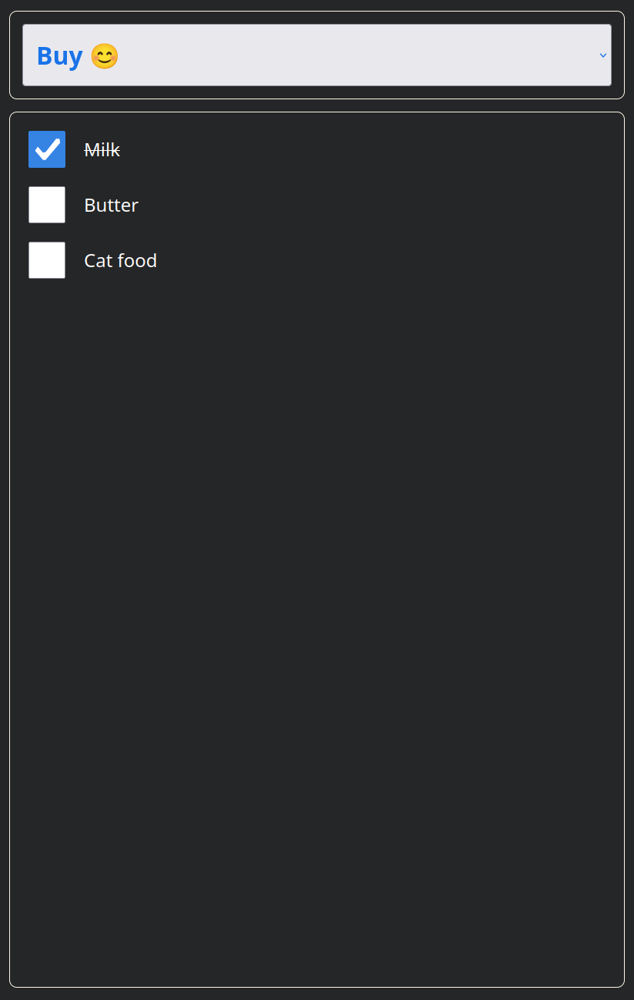
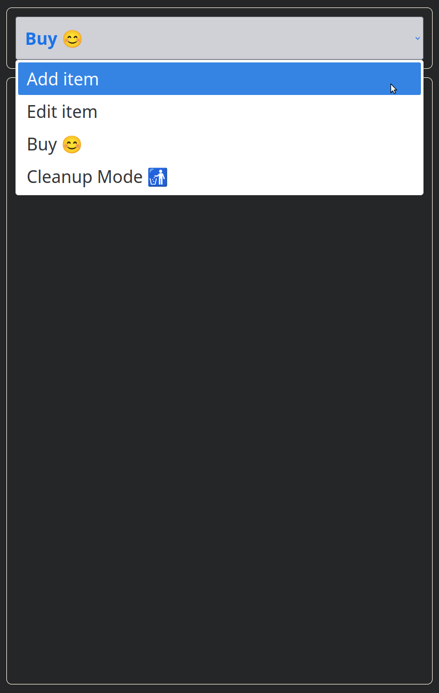
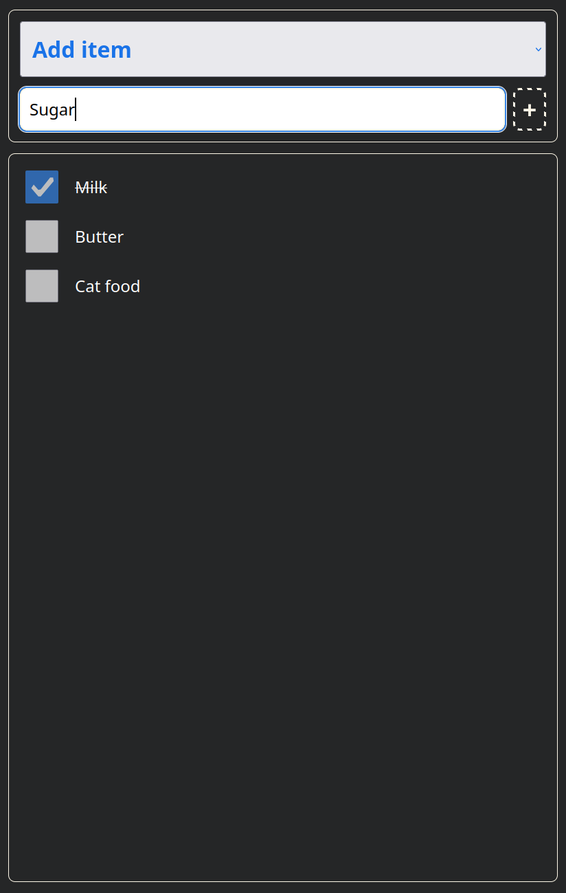
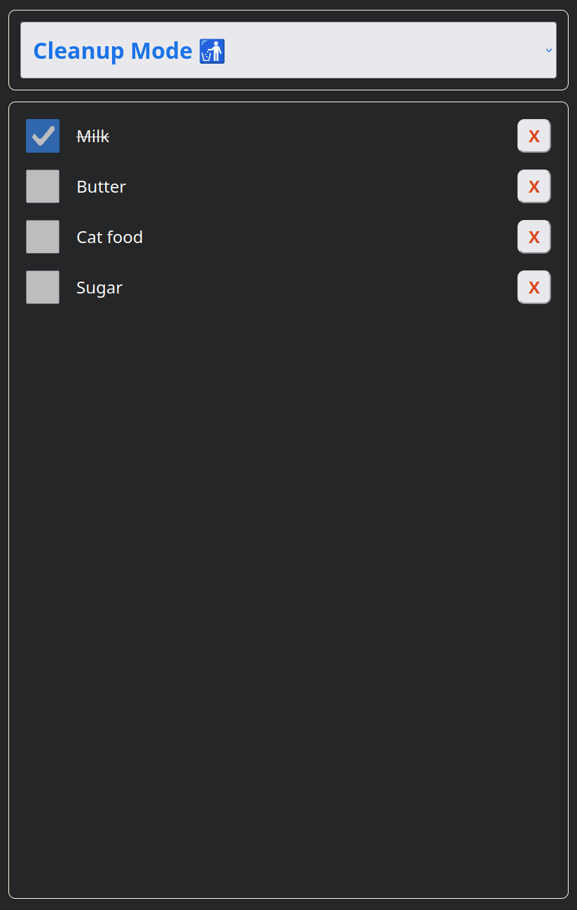

# Shopping List Application - Frontend

A simple and interactive frontend of a shopping list web application with API integration and local storage fallback.

[](#) [](LICENSE) [](#) [](#)

## Table of Contents

- [Key Features](#key-features)
- [Installation](#installation)
- [Usage / Quick Start](#usage--quick-start)
- [Configuration / Environment Variables](#configuration--environment-variables)
- [API Reference](#api-reference)
- [License](#license)
- [Authors / Acknowledgements](#authors--acknowledgements)

## Key Features

- Add, edit, buy, and delete shopping list items with an intuitive UI.
- Supports multiple action modes: Add Item, Edit Item, Buy, and Cleanup Mode.
- Persistent storage via API backend or local storage in development mode.
- Real-time updates and synchronization with backend.
- Built with TypeScript, Vite, and axios for modern frontend development.
- Modular architecture with clear separation of concerns.
- **Designed for seamless multi-user shopping experiences when paired with a suitable backend.**
- Perfectly optimized **to fit and function on smartphone screens** for convenient on-the-go use.

### Shopping List UI

#### Starting screen shows "Buy mode":



#### Menu to select the mode:



#### Mode to add new items:



#### Cleanup mode with delete buttons on the right side:



## Installation

Clone the repository and install dependencies:

```bash
git clone <repository-url>
cd shopping-list
npm install
```

## Usage / Quick Start

Start the development server:

```bash
npm run dev
```

Build the project for production and deploy:

```bash
npm run build
```

The build process runs TypeScript compilation, bundles with Vite, and then executes the `rollout.sh` script to copy the build output to the backend public folder.

## Configuration / Environment Variables

- The app detects development mode via `import.meta.env.MODE`.
- API endpoint is hardcoded as `/shopping-list/api` in `src/services/ApiStorageService.ts`.
- Adjust backend URL or environment variables as needed for deployment.

## API Reference

The frontend communicates with the backend API at `/shopping-list/api` with the following endpoints:

- `GET /items` - Retrieve all shopping list items.
- `POST /items` - Add a new item (expects `{ text, checked }`).
- `DELETE /items/:id` - Delete an item by ID.
- `PUT /items/:id` - Update an item or its text.
- `GET /check?counter=number` - Check for updates and synchronization.

## License

This project is licensed under the [MIT License](LICENSE).

## Authors / Acknowledgements

Developed by the project author.

Inspired by one of Dave Gray's tutorials on Youtube, or to be more precise, by his TypeScript project, which you can find  [here](https://www.youtube.com/watch?v=gieEQFIfgYc&t=14393s).

